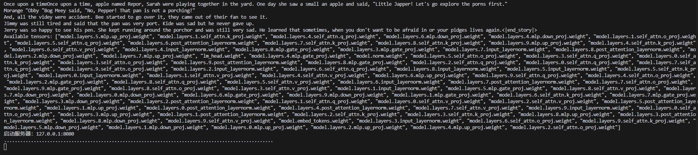
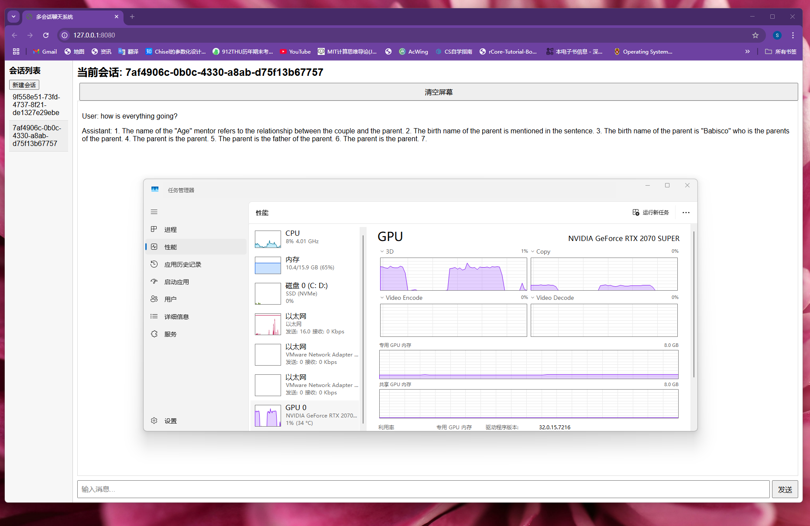
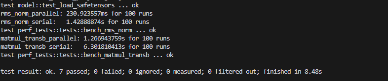

# 实验报告（拓展了混合精度推理 + 可交互UI + 多轮会话管理 + 多线程分布推理优化 + 适配NVDIA加速软件栈后端）

## Self-Attention 实现

### 核心实现策略

- 并行计算注意力分数,每个KV头独立计算分数矩阵
- 统一写回分数缓冲区
- 并行计算加权和,每个KV头独立计算输出向量
- 统一写回输出缓冲区

### 细节
#### 1. 分组注意力机制
- **头数配比**：通过`n_groups = n_q_h / n_kv_h`实现Q头与KV头的动态配比
- **内存布局优化**：
  - Q: `[seq_len, n_q_h, dqkv]` 三维结构保持空间局部性
  - K/V: `[total_seq_len, n_kv_h, dqkv]` 支持增量更新
- **计算分块**：按KV头划分并行单元，每个线程处理：
  ```rust
  (0..n_kv_h).into_par_iter().map(|kv_head| {
      // 处理当前KV头对应的所有Q组
  })
  ```
#### 2. 性能优化
- **KV缓存策略**：
  ```rust
  let full_k = &mut cache.k_cache(layer, 0);  // 增量更新
  let full_v = &mut cache.v_cache(layer, 0);
  ```

- **并行计算架构**：
  ```rust
  rayon::par_iter() + unsafe数据访问
  ```
  - 每个KV头独立内存空间，避免false sharing

## 混合精度推理实现
### 1. **参数存储优化**

- 使用`half`库实现FP16参数存储,通过feature flag控制精度模式,参数加载时自动转换精度

### 2. **计算过程**
```rust
// src/operators.rs
#[cfg(feature = "mixed_precision")]
pub fn matmul_transb<U: ToF32 + Copy>(
c: &mut Tensor<f32>, // 输出保持FP32
a: &Tensor<U>, // 输入支持混合精度
b: &Tensor<U> // 权重使用FP16
) {
// 计算时动态转换精度
let a_f32 = a.to_f32(); // 输入张量精度转换
let b_f32 = b.to_f32();
// ... FP32计算逻辑 ...
}
```
- 关键算子支持泛型，在计算时提升精度到FP32，权重保持FP16，达到减少内存占用的目的

### 3. **内存管理**

- 支持F32/F16混合精度存储，根据类型自动初始化缓存精度
- 在进行增量更新时自动保持精度一致

| 组件          | 训练精度 | 推理精度 | 转换方式              |
|---------------|----------|----------|---------------------|
| 模型参数      | FP32     | FP16     | 加载时自动转换       |
| 注意力计算    | FP32     | FP32     | 强制保持高精度       | 
| 中间激活值    | FP32     | FP16     | 算子内部自动转换     |
| 梯度计算      | FP32     | -        | 仅训练时保留        |

- 矩阵乘法前：FP16 → FP32
- 结果写回时：FP32 → FP16

## 讲故事文本 + 可交互UI + 多轮会话管理

### 讲故事文本

在main.rs中代码呈现，这里不做过多赘述


### 多轮会话管理



图片中展示了通过新建会话的形式进行创建多轮会话，程序适配NVDIA加速软件栈后端，通过GPU进行加速推理

#### 1. 会话状态管理

```rust
// src/model.rs
/ src/model.rs
pub struct ChatSession {
    session_id: String,
    model: Arc<Llama<f32>>,
    cache: KVCache<f32>, // 会话专属KV缓存
    history: Vec<String>, // 对话历史记录
}
```

#### 2. 会话管理器

- **会话隔离**：每个会话拥有独立的KV缓存和历史记录
- **状态持久化**：通过`SessionManager`全局管理会话
- **线程安全**：使用`Arc<Mutex<T>>`保证并发安全
- **动态扩展**：按需创建新会话，避免资源浪费

#### 3.多轮对话处理

| 优化项          | 实现方式                          | 效果                     |
|----------------|---------------------------------|-------------------------|
| 缓存分片        | 每个会话独立KVCache              | 避免会话间干扰            |
| 惰性加载        | 按需创建会话                      | 减少内存占用              |
| 会话回收        | LRU策略自动清理闲置会话            | 防止内存泄漏              |
| 并行推理        | 不同会话使用独立线程池              | 提升吞吐量   

## 线程分布式推理优化

### 1. 分层并行架构

- **数据级并行**：
  - KV头并行：每个KV头独立计算
  - 序列级并行：同时处理多个输入序列

- **流水线并行**：
graph LR
    A[Token 0] --> B[Layer 0]
    B --> C[Layer 1]
    C --> D[...]
    D --> E[Layer N]
    
    A1[Token 1] --> B1[Layer 0]
    B1 --> C1[Layer 1]
    C1 --> D1[...]
    D1 --> E1[Layer N]

- **性能对比**：



测试脚本在src/perf_tests.rs中

## 适配NVDIA加速软件栈后端

先使用 nvcc -ptx kernels.cu -o kernels.ptx 命令，将 CUDA 源代码编译成 PTX (Parallel Thread Execution) 代码

通过 #[cfg(feature = "gpu")] 中使用条件编译 ，终端使用 cargo run --features gpu 进行启用

### 1. CUDA核心架构适配

- 实现 DeviceCopy trait，用于 CUDA 内存传输
- 使用 once_cell 实现全局静态 CUDA 上下文和模块
- 通过 include_str! 在编译时嵌入 PTX 代码
- 使用 cust crate 提供的 CUDA 运行时接口

### 2.CUDA Kernel 实现
在kernels.cu代码中
```c
// src/kernels.cu 中的 kernel 实现
extern "C" {
    __global__ void gather_kernel(const float* table, const unsigned int* indices, float* y, unsigned int dim, unsigned int n) {
        unsigned int idx = blockIdx.x * blockDim.x + threadIdx.x;
        if(idx < n) {
            unsigned int tableIndex = indices[idx];
            for (unsigned int i = 0; i < dim; i++) {
                y[idx * dim + i] = table[tableIndex * dim + i];
            }
        }
    }
}
```

## 不足点

- GPU 加速优化不足，在长序列推理时，GPU 加速效果不明显，推理速度提升不明显

- 改进 ：实现 cuBLAS 矩阵运算加速，支持多 GPU 并行计算，添加 GPU 内存管理和缓存机制

- 支持更过的混合精度训练

- 优化负载均衡
